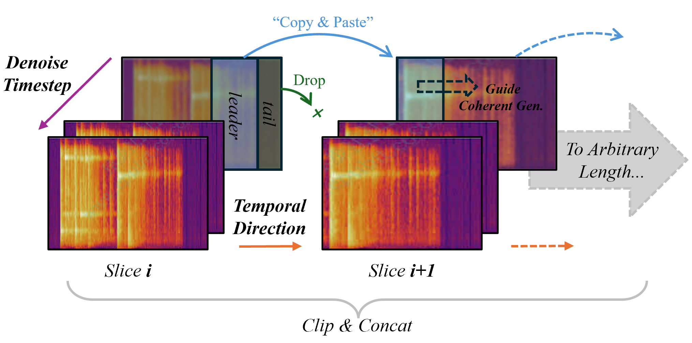

<div align="center">

# Mustango: Toward Controllable Text-to-Music Generation

[Demo](https://huggingface.co/spaces/declare-lab/mustango) | [Model](https://huggingface.co/declare-lab/mustango) | [Website and Examples](https://amaai-lab.github.io/mustango/) | [Paper](https://arxiv.org/abs/2311.08355) | [Dataset](https://huggingface.co/datasets/amaai-lab/MusicBench)

[](https://huggingface.co/spaces/declare-lab/mustango)
</div>

Meet Mustango, an exciting addition to the vibrant landscape of Multimodal Large Language Models designed for controlled music generation. Mustango leverages Latent Diffusion Model (LDM), Flan-T5, and musical features to do the magic!

🔥 Live demo available on [Replicate](https://replicate.com/declare-lab/mustango) and [HuggingFace](https://huggingface.co/spaces/declare-lab/mustango).

<div align="center">
  
</div>

## What's New?
Now you can generate arbitrary length music with amazing **coherence/temporal consistency**, and it's **training-free**! 
Just play with the original pretrained model and enjoy this free lunch:)
```python
import IPython
import soundfile as sf
from mustango import Mustango
model = Mustango("declare-lab/mustango")

prompt = """
This is a live performance of a classical music piece.
There is an orchestra performing the piece with a violin lead playing the main melody.
The atmosphere is sentimental and heart-touching.
This piece could be playing in the background at a classy restaurant.
The chord progression in this song is Am7, Gm, Dm, A7, Dm.
The beat is 3. This song is in Largo. The key of this song is D minor.
"""

# You can pass arbitrary duration (in secs) to the model. 
# (sure it takes longer to generate, as a ref: ~11mins for 1min music on my 7900xtx).
# n_slices_gen ≈ 1 + ceil(（t - 10） / 5)， t_to_gen = n_slices_gen * t_single_run
# it can be faster, but that would be an efficiency-consisteny trade-off.
music, slices = model.generate_longer(prompt, n_secs=60)  
IPython.display.Audio(data=music, rate=16000)
```

###  ❔ How It Works?
<div align="center">
  
</div>


### 🎵 Demo Audio
Here are some demo musics (with length ranging from 20s to over 90s):
- Prompt: *"This techno song features a synth lead playing the main melody. This is accompanied by programmed percussion playing a simple kick focused beat. The hi-hat is accented in an open position on the 3-and count of every bar. The synth plays the bass part with a voicing that sounds like a cello. This techno song can be played in a club. The chord sequence is Gm, A7, Eb, Bb, C, F, Gm. The beat counts to 2. The tempo of this song is 128.0 beats per minute. The key of this song is G minor."*  🎧 [Link to the audio file](assets/demo_audio/demo_1_techno_song.wav)
- Prompt: *"This is a live performance of a classical music piece. There is an orchestra performing the piece with a violin lead playing the main melody. The atmosphere is sentimental and heart-touching. This piece could be playing in the background at a classy restaurant. The chord progression in this song is Am7, Gm, Dm, A7, Dm. The beat is 3. This song is in Largo. The key of this song is D minor."* 🎧 [Link to the audio file](assets/demo_audio/demo_2_classical_music.wav)
- Check [assets/demo_audio](assets/demo_audio) folder for more!


https://github.com/user-attachments/assets/7ec8eb3f-8525-4b44-ad4a-f2f61fc9ebc4


https://github.com/user-attachments/assets/a4e12c65-2a41-44d8-856b-20fbdeddc142


---

## Quickstart Guide

Generate music from a text prompt:

```python
import IPython
import soundfile as sf
from mustango import Mustango

model = Mustango("declare-lab/mustango")

prompt = "This is a new age piece. There is a flute playing the main melody with a lot of staccato notes. The rhythmic background consists of a medium tempo electronic drum beat with percussive elements all over the spectrum. There is a playful atmosphere to the piece. This piece can be used in the soundtrack of a children's TV show or an advertisement jingle."

music = model.generate(prompt)
sf.write(f"{prompt}.wav", music, samplerate=16000)
IPython.display.Audio(data=music, rate=16000)
```

## Installation

```bash
git clone https://github.com/AMAAI-Lab/mustango
cd mustango
pip install -r requirements.txt
cd diffusers
pip install -e .
```

## Datasets

The [MusicBench](https://huggingface.co/datasets/amaai-lab/MusicBench) dataset contains 52k music fragments with a rich music-specific text caption. 
## Subjective Evaluation by Expert Listeners

| **Model** | **Dataset** | **Pre-trained** | **Overall Match** ↑ | **Chord Match** ↑ | **Tempo Match** ↑ | **Audio Quality** ↑ | **Musicality** ↑ | **Rhythmic Presence and Stability** ↑ | **Harmony and Consonance** ↑ |
|-----------|-------------|:-----------------:|:-----------:|:-----------:|:-----------:|:----------:|:----------:|:----------:|:----------:|
| Tango     | MusicCaps   | ✓               | 4.35      | 2.75      | 3.88      | 3.35     | 2.83     | 3.95     | 3.84     |
| Tango     | MusicBench  | ✓               | 4.91      | 3.61      | 3.86      | 3.88     | 3.54     | 4.01     | 4.34     |
| Mustango  | MusicBench  | ✓               | 5.49      | 5.76      | 4.98      | 4.30     | 4.28     | 4.65     | 5.18     |
| Mustango  | MusicBench  | ✗               | 5.75      | 6.06      | 5.11      | 4.80     | 4.80     | 4.75     | 5.59     |


## Training

We use the `accelerate` package from Hugging Face for multi-gpu training. Run `accelerate config` from terminal and set up your run configuration by the answering the questions asked.

You can now train **Mustango** on the MusicBench dataset using:

```bash
accelerate launch train.py \
--text_encoder_name="google/flan-t5-large" \
--scheduler_name="stabilityai/stable-diffusion-2-1" \
--unet_model_config="configs/diffusion_model_config_munet.json" \
--model_type Mustango --freeze_text_encoder --uncondition_all --uncondition_single \
--drop_sentences --random_pick_text_column --snr_gamma 5 \
```

The `--model_type` flag allows to choose either Mustango, or Tango to be trained with the same code. However, do note that you also need to change `--unet_model_config` to the relevant config: diffusion_model_config_munet for Mustango; diffusion_model_config for Tango.

The arguments `--uncondition_all`, `--uncondition_single`, `--drop_sentences` control the dropout functions as per Section 5.2 in our paper. The argument of `--random_pick_text_column` allows to randomly pick between two input text prompts - in the case of MusicBench, we pick between ChatGPT rephrased captions and original enhanced MusicCaps prompts, as depicted in Figure 1 in our paper.

Recommended training time from scratch on MusicBench is at least 40 epochs.


## Model Zoo

We have released the following models:

Mustango Pretrained: https://huggingface.co/declare-lab/mustango-pretrained


Mustango: https://huggingface.co/declare-lab/mustango


## Citation
Please consider citing the following article if you found our work useful:
```
@inproceedings{melechovsky2024mustango,
  title={Mustango: Toward Controllable Text-to-Music Generation},
  author={Melechovsky, Jan and Guo, Zixun and Ghosal, Deepanway and Majumder, Navonil and Herremans, Dorien and Poria, Soujanya},
  booktitle={Proceedings of the 2024 Conference of the North American Chapter of the Association for Computational Linguistics: Human Language Technologies (Volume 1: Long Papers)},
  pages={8286--8309},
  year={2024}
}
```
